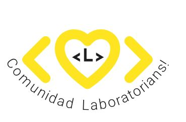
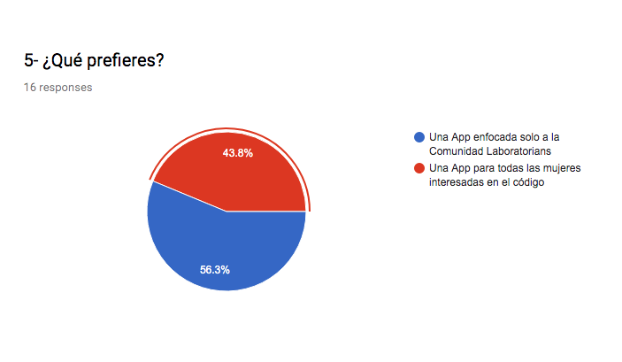
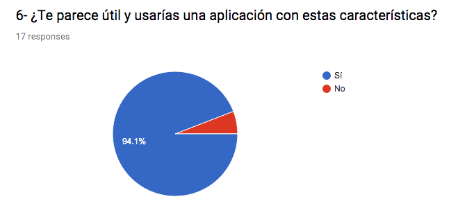

# Comunidad Laboratorians!
​
  

## Índice
​
* [Definición del Producto](#definicion)
* [Link de la APP ](#link)
* [Historias de Usuarios](#historias-de-usuarios)
* [Planificación](#planificacion)
* [Diseño de Interfaz](#diseño)
* [Consideraciones técnicas](#consideraciones-técnicas-front-end)
​
## Definición del Producto 
​
Laboratorians es una AppWeb que surge principalmente para las estudiantes y egresadas de Laboratoria en donde encuentren un espacio en común para compartir historias , consejos , reseñas, cursos, charlas , trabajos tech, o lo que deseen publicar en la comunidad chilena o Latinoamericana.
​
### Usuario  
​
A mujeres que sean o hayan sido parte de las diferentes generaciones de bootcamps de Laboratoria en Chile y en la distintas sedes de latinoamerica. 
​
### Problemáticas a abarcar 
​
Las problemas que detectamos son : 
- Carencia de comunidad entre mujeres egresadas desde las primeras generaciones a la fecha 
- Falta de red de apoyo entre estudiantes activas de un mismo track en diferentes países 
- Ausencia de comunicación entre mujeres que cursen diferentes tracks 
- No todas las estudiantes mantienen cuentas activas en Facebook o Instagram que es donde Laboratoria oficial tiene su comunidad
- El contenido en RRSS antes mencionadas suele ser de publicidad o convocatorias a  Laboratoria , más que una comunidad activa que pueda contar como red de apoyo 
- Existe Slack, en donde puedes encontrar a otras estudiantes , sin embargo si no pagas una suscripción mensual, la cantidad de msjes que puedes revisar en el historial es limitada
​
### Solución 
La creación de "Laboratorians" es una appWeb donde las mujeres de Laboratoria pueden crear una cuenta,indicando si son estudiantes o egresadas y puedan ser parte de una comunidad activa de mujeres en el codigo, accediendo  y creando lazos con las diferentes generaciones y paises  , información actualizada de diferentes temáticas relacionadas al mundo tech , informar cuales son las tendencias, invitaciones a charlas u eventos, solicitar u ofrecer trabajos o servicios relacionados con la tecnologia, para las  nuevas estudiantes recibir consejos y tips de egresadas y compañeras que hayan pasado por los mismos trabajos y  conocer nuevas amigas .
​
### Objetivo de la Aplicación
​
El objetivo principal de aprendizaje es construir una AppWeb con Single-page Application (SPA) responsive (con más de una vista / página) en la que podamos leer y escribir datos.
​
La interfaz permite  lo siguiente:
​
- Creación de cuenta de usuario e inicio de sesión 
- Autenticación con Facebook y/o Google y/o Email utilizando Firebase 
- Crear Muro/timeline de la red social , para publicar post, dar like a una publicación, llevar un conteo de los likes, eliminar un post específico.
​
## Link de la APP 
​
Puedes encontrar la App en el siguiente link 
[Link](https://adrievelyn.github.io/SCL010-Social-Network/src/index.html)
​
## Encuesta
​
Se redacta y ejecuta una encuesta con el Formulario de Google Forms, para definir los parámetros generales de la aplicación, por ejemplo a qué usuario nos vamos a dirigir, cuáles son sus necesidades , como también para obtener claridad sobre cuál es la información más relevante a la que dichos usuarios necesitarían acceso.
​
Con ésta información se plantea la jerarquización de la data y de sus funcionalidades para poder acomodarla dentro del flujo de la aplicación junto con parámetros de usabilidad (web y móvil) como también de diseño de interface (UI).
​
La encuesta alcanzó un total de 19 respuestas en un día y se puede encontrar haciendo click  [Encuesta](https://docs.google.com/forms/d/1t352sbh-EMpX-eMze90nhKXZ5Y4WrK_BrFf4yn-qM64/prefill)📝
​
- Conclusiones de la encuesta:

​
A partir de los resultados pudimos obtener y definir:
​
- Nuestro usuario target: Comunidad de laboratoria
- Información relevante para un publicar   y leer en el muro: Noticias y eventos , consejos, tutoriales,tips.
​
##Historias de Usuario:
​
### Historia de Usuario 1 : Crear Cuenta con Google
	"Yo, como estudiante de Laboratoria.
 	Quiero, poder loguearme.
 	Para, acceder con Google a la Red Social Laboratorians."
​
➡ Criterios de aceptación: Creamos en la App Web con un  botón para iniciar sesión con google abriendo un pop-up para loguearse con google con su correo y contraseña. Si los datos son validos, se crea un perfil y le permite entrar a laboratorians.

### Historia de Usuario 2 : Crear Cuenta con Registro a través de formulario 
	"Yo, como estudiante del bootcamp. 
 	Quiero, poder registrarme en Laboratorians con cualquier correo y contraseña.
 	Para, poder ingresar de forma espedita y segura."

 ➡ Criterios de aceptación: Creamos en la App Web  un boton que permite registrarse  "creando cuenta" , para que el usuario pueda escribir su correo y contraseña, si el correo no es valido se envia un mensaje de error y se envia un correo de verificación cuando la cuenta ha sido creada exitosamente.

### Historia de Usuario 3 : Iniciar Sesión ( con cuenta creada )
	"Yo, como usuario ya registrado.
	 Quiero, poder ingresar con mi correo y contraseña.
	 Para, optimizar y ocupar la red social."
​
➡ Criterios de aceptación: En la App Web muestra un botón donde estan los  campos para ingresar el correo y contraseña. El usuario debe poder escribir su correo  y contraseña , y  apretar el boton de iniciar sesion. Si los datos son validos, el usuario puede ingresar a la red social pero si los datos no son validos se genera un mensaje de error.

### Historia de Usuario 4 : Publicar en el muro 
	"Yo, como estudiante.
	 Quiero, ver y poder publicar en  el muro  de la App.
	 Para,  informarme de las novedades , subir publicaciones y estar al tanto de todo lo que pasa."
​
➡ Criterios de aceptación: En la pagina del muro , se permitira usuario escribir atraves de un cuadro de texto , y asi informar a la comunidad o el fin que el usuario quiera . 
​
### Historia de Usuario 5 : Editar Publicación
"Yo, como estudiante.
	 Quiero, editar la publicacion que subi en mi muro .
	 Para, colocar otrod datos y fuentes que me faltarón  ."
​
➡ Criterios de aceptación: En la pagina del muro, habra un boton para poder editar lo escrito , y poder publicar lo que realmente quiero.

### Historia de Usuario 6 : Eliminar Publicación
"Yo, como estudiante.
	 Quiero, eliminar la publicación .
	 Para, poder subir otra de un tema mas interesante ."
​
➡ Criterios de aceptación: En la pagina del muro, habrá un botón de eliminar para no visualizar lo escrito.

### Historia de Usuario 7 : Dar Like y contabilizar.
"Yo, como estudiante.
	 Quiero, dar likes y contabilizarlos.
	 Para,  informar que me gusta la publicación."
​
➡ Criterios de aceptación: En la pagina del muro, se vera un botón para que el usuario pueda colocar Likes .
​

​## Diagrama de Flujo  
​
A partir de las historias de usuario se define el flujo básico de la aplicación:

  

​
## Planificación 
​
Se definen acciones y funciones que nuestro usuario necesita y quiere realizar dentro de la app para lograr sus objetivos. La planificación se realizó mediante un trabajo colaborativo en Trello, el cuál puedes revisar en el siguiente link [LinkTrello](https://trello.com/b/FSFHhEWS/red-social) y utilizando ceremonias ágiles para verificar las tareas que va realizando cada miembro del equipo –así detectamos a tiempo bloqueos, dailys y retrospectivas diarias.
​
​
## Diseño de Interfaz
​
####Prototipo de Baja Fidelidad 

  
​
####Prototipo de Alta Fidelidad 
​
Después de la definición de usuario, de sus características, intereses y gustos, se define el diseño visual de nuestra aplicación en términos de color, fuente, logo y contenido de imágenes entre otros.
​
Para la paleta de colores se establecio viendo todos los colores que eran usados por laboratoria en las redes sociales, donde predomina el amarillo , rosado , verde , negro y escala de grises 
​
​
##Organización del Squads en Trello:
https://trello.com/b/FSFHhEWS/red-social

​
## Evaluación heurística 
Realizamos la evaluación para nuestra página web en el siguiente sitio: [haz click aquí](https://docs.google.com/spreadsheets/d/1kQ9hsZ9nWkKCiiaW9uN-zUcRCISYY0WRtSaQyXn-XV0/edit?usp=sharing)
​
##Consideraciones técnicas ( Build with )
​
- Vanilla Javascript (ES6)
- Firebase - // Firestore
- HTML5
- CSS
- Figma // AdobeXD
​
### Desarrolladoras
​
- [Adriana Sanchez](https://github.com/adrievelyn)
- [Alejandra Morales](https://github.com/AlejandraMoralesB)
- [Cynthia Gomez](https://github.com/cynthiagomezmontoya)
- [Paula Estay ](https://github.com/paulaestayc)

​